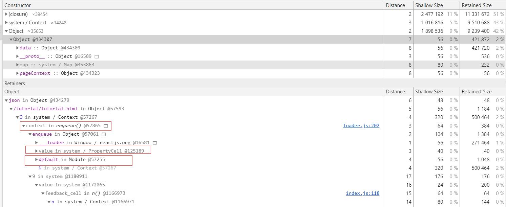

## Chrome-devtools
关于chrome-devtools中的内存分析工具[memory](https://developers.google.com/web/tools/chrome-devtools/memory-problems/)
和[performance](https://developers.google.com/web/tools/chrome-devtools/evaluate-performance/)
的介绍

## 写在前面
如果要分析一个的页面的内存泄露，我们需要知道一般有以下几种可能
* 游离的DOM的引用 (删除了DOM，事件没移除)
* 定时器
* 闭包
* 全局变量   

## memory 内存分析工具

###工具按钮介
* 开始记录
* 清除文件
* 主动垃圾回收

### 分析类型 (最新版`75.0.3770.80`的chrome有3个)
* snapshot 堆快照可以为您显示拍摄快照时内存在您页面的 JS 对象和 DOM 节点间的分配，
并显示当前JavaScript对象的内存大小。快照每次都是主动触发一次GC后进行的。

* timeline 分配时间线是您可以用于跟踪 JS 堆中内存。   
横轴为时间，纵轴为占用内存大小。   
蓝色线条表示占用内存，灰色线条表示释放了的内存。 
通常建议在最后一次结束记录的时候主动触发一次GC然后结束，这样确保记录结果的准确性。   

* allocation sampling JavaScript 函数查看内存分配。

### 视图类型
* summary 显示按构造函数分组的对象

* comparison 显示两个快照之间的不同，用于比较操作前后的内存差异

* containment 对象结构视图？提供了3个方式的查看***window***、***GC root***、***object 原生对象***
如DOM节点、css

* statistic 统计视图

### 类型过滤 Class filter
可以通过这个过滤查找指定的构造函数类型的内存占用，其中比较好用的是搜索`DetachedHTMLXXX`，
快速查找游离的`DOM`元素

### 概念介绍
* Distance 这个指到GC root的距离，绝大部分的距离都相同，只有少数的距离会偏大。
大多数为3-4左右，个别10以上，着重查看这些深度高的对象，查看是什么引用着它。

* Shallow Size 浅层大小：对象自身占用的大小。

* Retained Size 保留大小：删除后可以释放内存的大小。以上都是以字节为单位，即使是很小的
Shallow Size也可以通过阻止其他对象的回收从而间接的占用大量内存。

### 构造函数的类型
* window 全局对象
* roots 根
* closure 闭包
*（array、string、number、regexp）不同对象类型的列表，这些类型具有引用 
Array、String、Number 或正则表达式的属性。
* (compiled code) 已编译代码相关的任何内容。
* HTMLDivElement 引用的元素

### 其他
对象的属性以及属性值属于不同类型，均为以下四种类型之一

* 有名称的常规属性。比较多的就是 `foo in Object`
* 有数字下标的常规属性。比较多的就是 `[0] in Object`
*  函数上下文中的某个变量，在相应的函数闭包中。
比较多的就是 `context in foo()`
* 由 JavaScript VM 添加的属性。无法从 JavaScript 代码访问。比如`foo in system / Context`

值类型举例

### performance 性能分析工具

